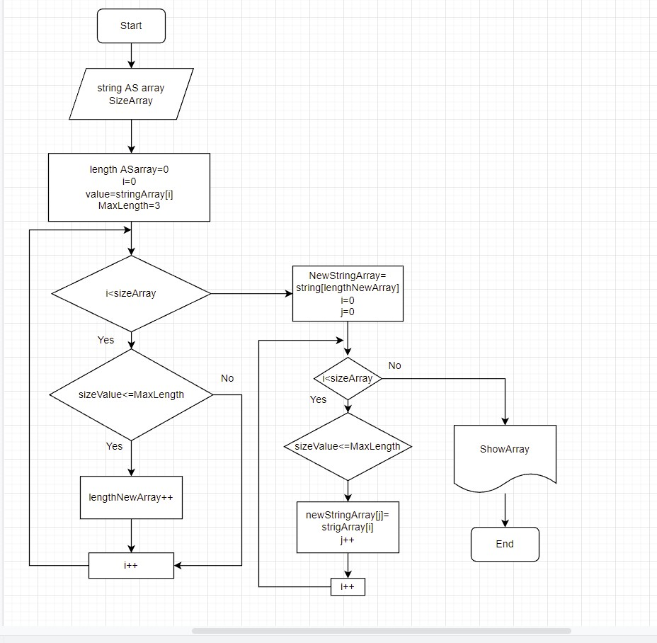

Задача:

Написать программу, которая из имеющегося массива строк формирует массив из строк, длина которых меньше либо равна 3 символа.

Блок - схема решения задачи:

1. Создаем первоначально массив вводом элементов через консоль.
2. Методом GetShortAS2 создаем новый массив, длина которы меньше или равна 3 символа.
3. Методом ShowArray Выводим созданный массив.